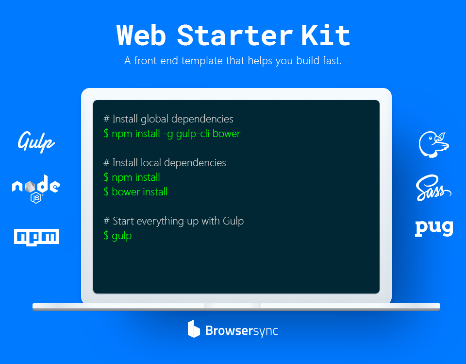

# 

[](https://travis-ci.org/abrahamcarvalhoo/web-starter-kit) [](https://gemnasium.com/abrahamcarvalhoo/web-starter-kit) [](https://codeclimate.com/github/abrahamcarvalhoo/web-starter-kit/coverage) [](https://codeclimate.com/github/abrahamcarvalhoo/web-starter-kit) [](https://app.codeship.com/projects/205237) [](https://opensource.org/licenses/MIT)

## Overview
**Web Starter Kit** is a front-end template that helps you build fast based on Gulp, Node, NPM, Bower, BrowserSync, Sass, and Pug.

## Setup

> Before you can install dependencies, you will need to install [Gulp](http://gulpjs.com/), [Node](https://nodejs.org/), [NPM](https://www.npmjs.com/), and [Bower](http://bower.io/).

```
$ npm cache clear && npm install && bower cache clean && bower install
```

## Available Tasks

> Run the default `watch` task.

```
$ gulp
```

> Minifies both the styles and scripts and outputs to the `build/` directory.

```
$ gulp build
```

> Build styles with pre-processors

```
$ gulp styles
```

> Build scripts

```
$ gulp scripts
```

> Build views with pre-processors

```
$ gulp views
```

> Copy image files

```
$ gulp images
```

> Copy font files

```
$ gulp fonts
```

> Copy public files

```
$ gulp public
```

> Remove build directory

```
$ gulp clean
```

